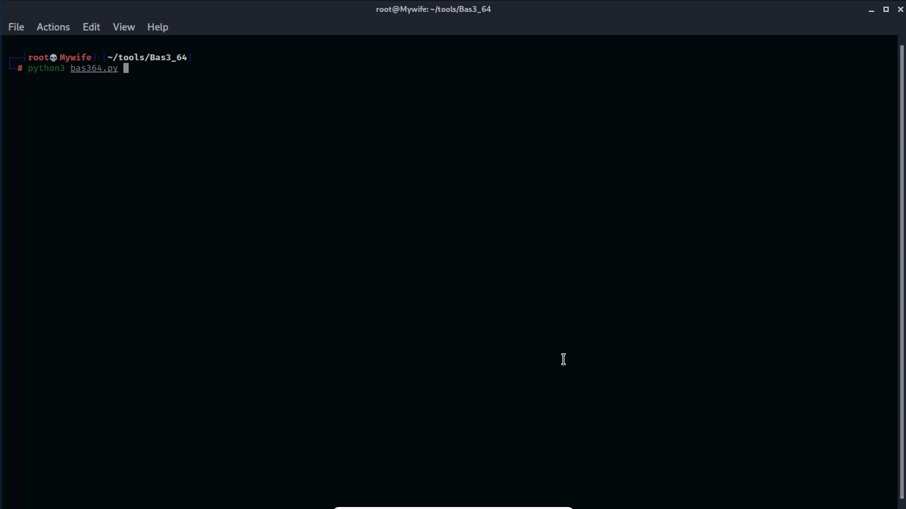

# Preview
   

How to run:
  # python3 bas364.py
run this tool with python3

Required modules:
       termcolor , os , base64
       
       
If any issues please tell me, let me try to solve it :)

Use this tool to encode and decode with base64... Two new modes available :D
